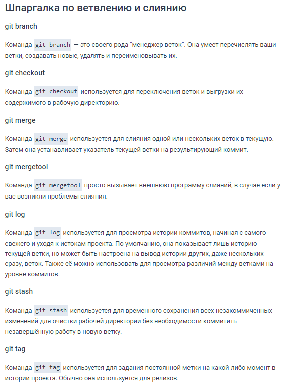

# Инструкция по git

## Процесс работы с Git

>Не стоит после каждого изменения файла делать commit. Чаще всего их создают, когда:
>
> * новый функционал
> * Добавлен новый блок на верстке
> * Исправлены ошибки по коду
> * Вы завершили рабочий день и хотите сохранить код
>
> Это поможет держать вашу ветки в чистоте и порядке. Тем самым, вы будете видеть историю изменений по каждому нововведению в вашем проекте, а не по каждому файлу

### Создание репозитория

* Инициализация/создание репозитория

        git init 
* Добавим все файлы проекта

        git add .
        git add --all
* Если хотим добавить конкретный файл то можно так

        git add <имя_файла>
* Теперь создаем commit. Обязательно указываем комментарий.

        git commit -m "<комментарий>"
* add + commit в одну команду

        git commit -am "комментарий"

---

## Команды git в картинках
* [Картинки взяты здесь](https://proglib.io/p/git-cheatsheet)

